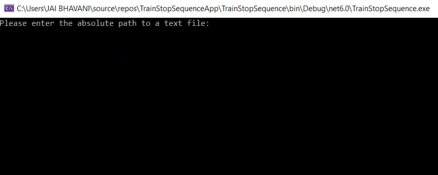
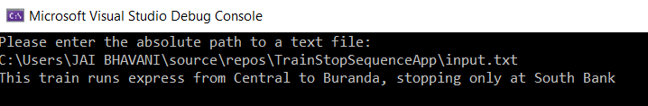

# Queensland Rail train stop sequence

This programming activity takes in the text file's absolute path and analyzes the train stop sequence to form a description.

### Steps to execute

1. Clone the GitHub repository locally on your computer.
2. Open the project in the Visual Studio 2022.
3. Build and run the solution.
4. Upon the successful build, the solution will run, and you will see the console window with a prompt to enter the text file's absolute path.

5. Enter the text file absolute path that has the train stop sequence.
6. The console will print the description of the given train stop sequence.
